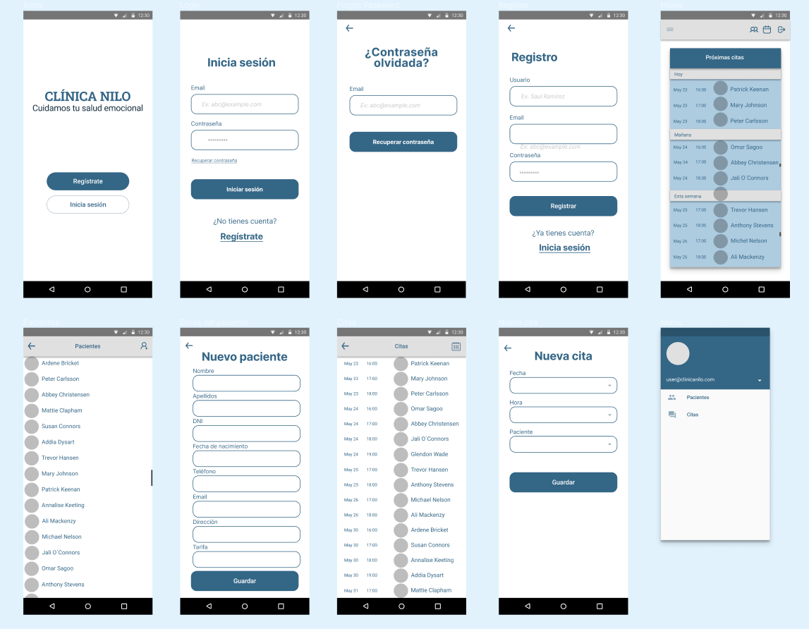

# Clinica Nilo FinalApp

## Anteproyecto

### Objetivos
Con este proyecto pondré en práctica los conocimientos que he adquirido durante mi formación en el CFGS en Desarrollo de Aplicaciones Multiplataforma, impartido en el IES Campanillas.

Los requisitos académicos que debe cumplir se indican en [la Wiki de este repositorio](https://github.com/IESCampanillas/proyectos-dam-2022/wiki).

### Temática
Se trata de un software de gestión empresarial específico para una clínica de salud mental, en la que se podrán gestionar tanto el listado de pacientes, como su historial, citas y facturas.

Partirá de la aplicación presentada en el primer trimestre, e incluirá, entre otras mejoras, el uso de Firebase para el almacenamiento de datos, el registro de usuarios, etc.

### Borrador de la aplicación

También se puede ver el fucionamiento de la aplicación en el vídeo de [este enlace](https://youtu.be/UODCABfGhTI).

### Revisión del anteproyecto 

Tras entregar el anteproyecto, he acudido a tutoría con Luís y hemos concretado qué funcionalidades quiero incluir en la aplicación. Hemos visto que tendré que replantear el enfoque que le había dado al proyecto, pues al ser un software para la empresa, la versión móvil no es muy práctica. Es por eso que, finalmente, la aplicación que se desarrollará con Ionic será la que utilice el paciente para solicitar y gestionar sus citas, y la dedicada a la empresa será la versión de administración, desarrollada con Angular.

Debido a lo anterior, habrá que añadir al prototipo diseñado en Figma la interfaz de visualización para el rol de paciente.

### Checkpoint 13/05/2022
[Vídeo](https://youtu.be/BpodOzBccV4)

En este punto se han incluido las funcionalidades de añadir cita, registro de usuarios, login y logout.
Las restricciones de usuario se han desabilitado en esta primera versión por fallos en el almacenaje y en la recuperación de las colecciones de datos relativas a cada cuenta.

Además, se incluiran las opciones de completar el perfil de usuario, edición y borrado de las citas, elección de especialista médico y la restricción de citas disponibles según la disponibilidad del especialista. También se quiere incluir un módulo de comunicación entre médicos y pacientes dentro de la aplicación.
También se modificará el diseño de la interfaz para que coincida con el del borrador.

Descarga la [APK](./README/app-debug.apk) de la aplicación

### Bibliografía

Hasta el momento, la documentación consultada se limita a la oficial de ionic y al libro "Aprende ionic con ejercicios" de nuestro profesor.

